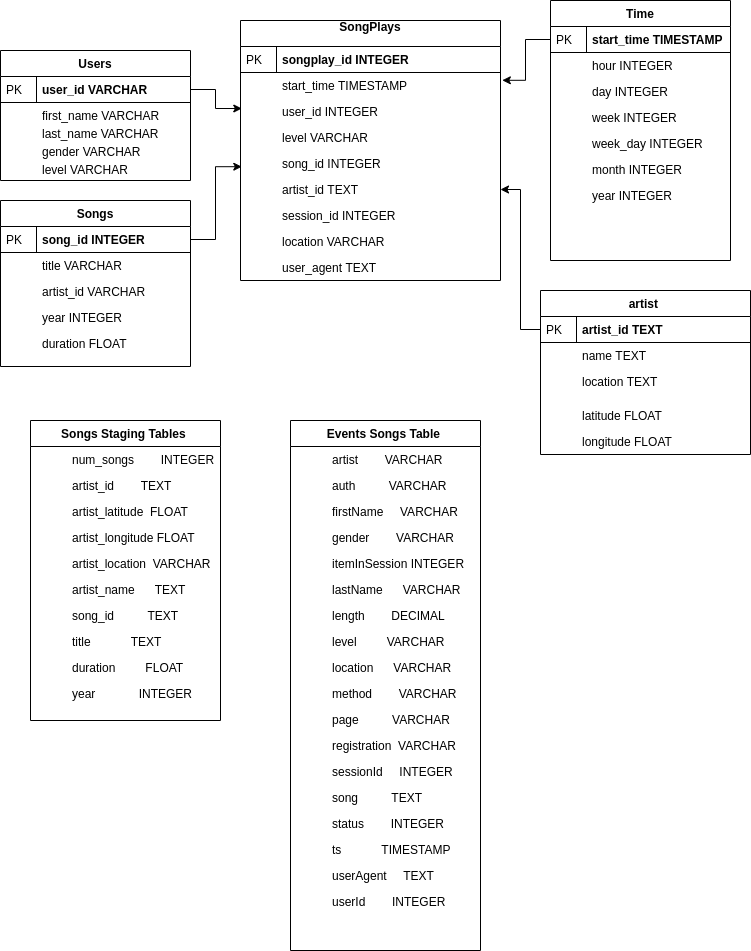
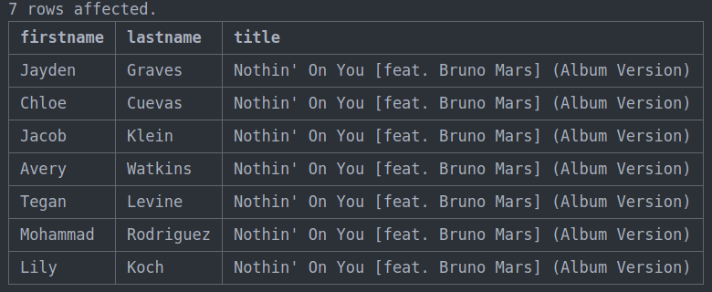

## Sparkify Data Warehouses Project


### Introduction

The goal of this project is to store data for a fictitious music company call Sparkify.  Currently, Sparkify’s data is stored in an Amazon S3 bucket as JSON data.  We are to move the data from an S3 bucket to an Amazon Redshift cluster in staging tables.  Once the data is stored in Redshift, we can then move the data to fact and dimension tables.  This will enable their analytics team to gain insight from the data.

**Please Note:** The environment used for this project was [Atom](https://atom.io/) text editor with the  [Hydrogen](https://atom.io/packages/hydrogen) package enabled.  This allows you to run code line by line in a similar way to a Jupyter Notebook. The only sheet that will not be able to run completely from the command line is the  “_Infrastructure-as-Code.py_” file. If you are unable to run line by line, please see additional instructions in the Infrastructure As Code section.  Below is an [Entity Relationship Diagram](https://en.wikipedia.org/wiki/Entity%E2%80%93relationship_model) (ERD) for what our final tables should look like:




### DWH config file

The dwh.cfg file is not included here but is used to store your Amazon Web Service (AWS)  credentials.  We are able to access this file using Pythons “_configparser_” library. The file should look something like the image below.


```python
[IAM]
KEY = *PI**P*Z*Y**VPRB3R
SECRET=**1**FXTPG*A/*WnF/v**E**x9Z88r*H0y*ke

[CLUSTER]
HOST = *w*fl*np0r.c**vbxxsx*0.us-west-2.redshift.amazonaws.com


DB_NAME={add from DWH_DB}
DB_USER = {add from DWH_DB_USER}
DB_PASSWORD= {add from DWH_DB_PASSWORD}
DB_PORT=5439

[DWH]
DWH_CLUSTER_TYPE=multi-node
DWH_NUM_NODES=4
DWH_NODE_TYPE=dc2.large
DWH_IAM_ROLE_NAME = {Choose Role Name}
DWH_CLUSTER_IDENTIFIER={Choose Identifier}
DWH_DB= {Chose DB Name}
DWH_DB_USER= {Choose Username Name}
DWH_DB_PASSWORD={Choose Password}
DWH_PORT=5439

[IAM_ROLE]
ARN='arn:aws:iam::**1**0**9**7:role/RNME'

[S3]
LOG_DATA='s3://udacity-dend/log_data'
LOG_JSONPATH='s3://udacity-dend/log_json_path.json'
SONG_DATA='s3://udacity-dend/song_data'
```


To begin, first create an [IAM user](https://docs.aws.amazon.com/IAM/latest/UserGuide/id_users_create.html).  Once you have created a user place your key and secrete in the IAM section.


### Infrastructure as code

Infrastructure as code (IaC) is the process of managing and provisioning computer data centers through machine-readable definition files, rather than physical hardware configuration or interactive configuration tools[<sup>1</sup>].  The advantage of infrastructure as code is that other developers can see exactly how you set up your environment.  For this project, we are going to use Pythons  [Boto3](https://pypi.org/project/boto3/)  library.  We will use this library to create our cluster and attach a role to it so that it can access the S3 bucket.  Please see explanation of code below:


1. Grab necessary credentials from config file

    a.
```python
    config = configparser.ConfigParser()
    config.read_file(open('dwh.cfg'))

    KEY = config.get('IAM','KEY')
    SECRET = config.get('IAM','SECRET')

    DWH_CLUSTER_TYPE       = config.get("DWH","DWH_CLUSTER_TYPE")
    DWH_NUM_NODES          = config.get("DWH","DWH_NUM_NODES")
    DWH_NODE_TYPE          = config.get("DWH","DWH_NODE_TYPE")

    DWH_CLUSTER_IDENTIFIER = config.get("DWH","DWH_CLUSTER_IDENTIFIER")
    DWH_DB                 = config.get("DWH","DWH_DB")
    DWH_DB_USER            = config.get("DWH","DWH_DB_USER")
    DWH_DB_PASSWORD        = config.get("DWH","DWH_DB_PASSWORD")
    DWH_PORT               = config.get("DWH","DWH_PORT")

    DWH_IAM_ROLE_NAME      = config.get("DWH", "DWH_IAM_ROLE_NAME")
```
2. Boto 3 client set up

    a.
```python
    ec2 = boto3.resource('ec2',
      region_name="us-west-2",
      aws_access_key_id=KEY,
      aws_secret_access_key=SECRET
                    )

    s3 = boto3.resource('s3',
      region_name="us-west-2",
      aws_access_key_id=KEY,
      aws_secret_access_key=SECRET
                   )

    iam = boto3.client('iam',aws_access_key_id=KEY,
      aws_secret_access_key=SECRET,
      region_name='us-west-2')

    redshift = boto3.client('redshift',
      region_name="us-west-2",
      aws_access_key_id=KEY,
      aws_secret_access_key=SECRET
                         )
```
3. IAM Role

    a.
```python
    from botocore.exceptions import ClientError

    try:
        print("1.1 Creating a new IAM Role")
        dwhRole = iam.create_role(
            Path='/',
            RoleName=DWH_IAM_ROLE_NAME,
            Description = "Allows Redshift clusters to call AWS services on your behalf.",
            AssumeRolePolicyDocument=json.dumps(
                {'Statement': [{'Action': 'sts:AssumeRole',
                   'Effect': 'Allow',
                   'Principal': {'Service': 'redshift.amazonaws.com'}}],
                 'Version': '2012-10-17'})
        )
    except Exception as e:
        print(e)    
```

4. Attach a policy to the role

    a.   
```python

    print("1.2 Attaching Policy")

    iam.attach_role_policy(RoleName=DWH_IAM_ROLE_NAME,
                       PolicyArn="arn:aws:iam::aws:policy/AmazonS3ReadOnlyAccess"
                      )['ResponseMetadata']['HTTPStatusCode']
```

5. Create the Redshift Cluster

a.

```python
    try:
      response = redshift.create_cluster(

        ClusterType=DWH_CLUSTER_TYPE,
        NodeType=DWH_NODE_TYPE,
        NumberOfNodes=int(DWH_NUM_NODES),

        DBName=DWH_DB,
        ClusterIdentifier=DWH_CLUSTER_IDENTIFIER,
        MasterUsername=DWH_DB_USER,
        MasterUserPassword=DWH_DB_PASSWORD,

        IamRoles=[roleArn]
        )
        except Exception as e:
          print(e)
```
b. **Check cluster** Do Not continue until the cluster status reads **available** keep running describe_clusters and prettyRedshiftProps to check status.

```python
    def prettyRedshiftProps(props):
      pd.set_option('display.max_colwidth', -1)
      keysToShow = ["ClusterIdentifier", "NodeType", "ClusterStatus", "MasterUsername", "DBName", "Endpoint", "NumberOfNodes", 'VpcId']
      x = [(k, v) for k,v in props.items() if k in keysToShow]
      return pd.DataFrame(data=x, columns=["Key", "Value"])

      myClusterProps = redshift.describe_clusters(ClusterIdentifier=DWH_CLUSTER_IDENTIFIER)['Clusters'][0]
      prettyRedshiftProps(myClusterProps)

```


6. Print dwh endpoint and role ANR

a.
```python
    DWH_ENDPOINT = myClusterProps['Endpoint']['Address']
    DWH_ROLE_ARN = myClusterProps['IamRoles'][0]['IamRoleArn']
    print("DWH_ENDPOINT :: ", DWH_ENDPOINT)#place as HOST in dwh.cfg
    print("DWH_ROLE_ARN :: ", DWH_ROLE_ARN)#place as ARN dwh.cfg
```

b. Place both in the config file for later user  

7. Give access to TCP port to access the cluster and endpoint

    a.
```python
    try:
    vpc = ec2.Vpc(id=myClusterProps['VpcId'])
    defaultSg = list(vpc.security_groups.all())[0]
    print(defaultSg)
    defaultSg.authorize_ingress(
        GroupName=defaultSg.group_name,
        CidrIp='0.0.0.0/0',
        IpProtocol='TCP',
        FromPort=int(DWH_PORT),
        ToPort=int(DWH_PORT)
    )
except Exception as e:
    print(e)
```  


8. Check connection.

    a.
```python
    %load_ext sql
    conn_string="postgresql://{}:{}@{}:{}/{}".format(DWH_DB_USER, DWH_DB_PASSWORD, DWH_ENDPOINT, DWH_PORT,DWH_DB)
    print(conn_string)
    %sql $conn_string
```  

9. Test Query

    a.
```python
    %%sql
    SELECT
    users.first_name,
    users.last_name
    from users
    LEFT JOIN songplays on songplays.song_id = users.song_id
    LEFT JOIN songs on songplays.song_id = songs.song_id
    WHERE songs.title = 'All Hands Against His Own';
```  

10. Delete Cluster and roles

    a.
```python
    '''
    STEP 5: Clean up your resources
    '''
    redshift.delete_cluster( ClusterIdentifier=DWH_CLUSTER_IDENTIFIER,  SkipFinalClusterSnapshot=True)

    '''
    run to be sure cluster is deleated
    '''
    myClusterProps = redshift.describe_clusters(ClusterIdentifier=DWH_CLUSTER_IDENTIFIER)['Clusters'][0]
    prettyRedshiftProps(myClusterProps)
    '''
    Run to remove roles
    '''
    iam.detach_role_policy(RoleName=DWH_IAM_ROLE_NAME, PolicyArn="arn:aws:iam::aws:policy/AmazonS3ReadOnlyAccess")
    iam.delete_role(RoleName=DWH_IAM_ROLE_NAME)
```  

**Additional instructions:** If you are running this file from the command line, please comment out everything after prettyRedshiftProps(myClusterProps) (see 5.a).  Wait about 10 minutes and then comment out steps 3 -5 (you can still run 5a )  and 7-10.  Steps 9 and 10 should not run until we extract have run our scripts to create our tables and clean our data. Steps 8 and 9 can be modified to use pythons [psycopg2](https://pypi.org/project/psycopg2/)  library to work from the command line instead of using the SQL [Jupyter Magic Methods](https://towardsdatascience.com/jupyter-magics-with-sql-921370099589https://towardsdatascience.com/jupyter-magics-with-sql-921370099589).   


### SQL Queries

This file contains all of the logic to remove (drop) and add (create) tables as well as insert the data into their respective tables.  It is important to note that this file (sql_queries.py) only contains the logic for the queries to be performed and no actual queries are performed in this file.  

We will first define a drop command for all of our tables to ensure that we can start from scratch.
```python

staging_events_table_drop = "DROP TABLE IF EXISTS staging_events;"
staging_songs_table_drop = "DROP TABLE IF EXISTS staging_songs;"
songplay_table_drop = "DROP TABLE IF EXISTS songplays;"
user_table_drop = "DROP TABLE IF EXISTS users;"
song_table_drop = "DROP TABLE IF EXISTS songs;"
artist_table_drop = "DROP TABLE IF EXISTS artists;"
time_table_drop = "DROP TABLE IF EXISTS times;"

```

Next, we will define our create tables statements, we will auto increment using the Identity command to make a primary key for our “_songplay_id_” field in our songplays table.  We then will create the logic to copy our staging tables.

```python

staging_events_table_create= ("""
CREATE TABLE IF NOT EXISTS staging_events
(
artist        VARCHAR,
auth          VARCHAR,
firstName     VARCHAR,
gender        VARCHAR,
itemInSession INTEGER,
lastName      VARCHAR,
length        DECIMAL,
level         VARCHAR,
location      VARCHAR,
method        VARCHAR,
page          VARCHAR,
registration  VARCHAR,
sessionId     INTEGER,
song          TEXT,
status        INTEGER,
ts            TIMESTAMP,
userAgent     TEXT,
userId        INTEGER
);
""")

staging_songs_table_create = ("""
CREATE TABLE IF NOT EXISTS staging_songs
(
num_songs        INTEGER,
artist_id        TEXT,
artist_latitude  FLOAT,
artist_longitude FLOAT,
artist_location  VARCHAR,
artist_name      TEXT,
song_id          TEXT,
title            TEXT,
duration         FLOAT,
year             INTEGER
);
""")

songplay_table_create = ("""
CREATE TABLE IF NOT EXISTS songplays
(
songplay_id INTEGER IDENTITY(0,1) PRIMARY KEY,
start_time  TIMESTAMP NOT NULL,
user_id     INTEGER NOT NULL,
level       VARCHAR,
song_id     TEXT NOT NULL,
artist_id   TEXT NOT NULL,
session_id  INTEGER NOT NULL,
location    VARCHAR,
user_agent  TEXT
);
""")

user_table_create = ("""
CREATE TABLE IF NOT EXISTS users
(
user_id    INTEGER IDENTITY(0,1) PRIMARY KEY,
first_name TEXT,
last_name  TEXT,
gender     TEXT,
level      TEXT
);
""")

song_table_create = ("""
CREATE TABLE IF NOT EXISTS songs
(
song_id   TEXT PRIMARY KEY,
title     TEXT,
artist_id TEXT NOT NULL,
year      INTEGER,
duration  FLOAT
);
""")

artist_table_create = ("""
CREATE TABLE IF NOT EXISTS artists
(
artist_id TEXT PRIMARY KEY,
name      TEXT,
location  TEXT,
latitude  FLOAT,
longitude FLOAT
);
""")

time_table_create = ("""
CREATE TABLE IF NOT EXISTS time
(
start_time TIMESTAMP PRIMARY KEY,
hour       INTEGER NOT NULL,
day        INTEGER NOT NULL,
week       INTEGER NOT NULL,
month      INTEGER NOT NULL,
year       INTEGER NOT NULL,
weekday    INTEGER NOT NULL
);
""")

```  

Next, we will create our staging tables by using the copy command.  In order to access the staging tables we will have to attach the IAM Role we attached to our redshift cluster we set up during the infrastructure as code process.  Since all of our access information is stored in our config file, we can use the config parser to enter the information needed.

```python

staging_events_copy = ("""
COPY staging_events
FROM {}
IAM_ROLE {}
JSON {}
REGION 'us-west-2'
TIMEFORMAT AS 'epochmillisecs'
BLANKSASNULL EMPTYASNULL;
""").format(config.get("S3", "LOG_DATA"), config.get("IAM_ROLE", "ARN"), config.get("S3", "LOG_JSONPATH"))
print(staging_events_copy)

staging_songs_copy = ("""
COPY staging_songs
FROM {}
IAM_ROLE {}
JSON 'auto'
REGION 'us-west-2'
TRUNCATECOLUMNS BLANKSASNULL EMPTYASNULL;
""").format(config.get("S3", "SONG_DATA"), config.get("IAM_ROLE", "ARN"))

```

We will finally create a  our insert statements.  Most of our insert  statement are strait forward.  In our Songplays insert statement, we first will perform a sub-query by joining  the songs and artist tables on artist_id in a sub-query.  We only want data where both the song_id and and artist_id are present, so we are sure to add in a where clause excluding any null values for song_id or artist_id.  We then join our sub query with our staging_events_table on the song and artist. Note that we do not add in the primary key to our insert table query  as that will be auto incremented as specified in the create table statement using the primary key and identity command.  

```python

user_table_insert = ("""
INSERT INTO users (first_name, last_name, gender, level)
SELECT  DISTINCT
        firstName AS first_name,
        lastName  AS last_name,
        gender    AS gender,
        level     AS level
FROM staging_events
WHERE page = 'NextSong';
""")

song_table_insert = ("""
INSERT INTO songs (song_id, title, artist_id, year, duration)
SELECT  DISTINCT
        song_id,
        title,
        artist_id,
        year,
        duration
FROM staging_songs
WHERE song_id is NOT NULL;
""")

artist_table_insert = ("""
INSERT INTO artists (artist_id, name, location, latitude, longitude)
SELECT  DISTINCT
        artist_id,
        artist_name      AS name,
        artist_location  AS location,
        artist_latitude  AS latitude,
        artist_longitude AS longitude
FROM staging_songs
WHERE artist_id is NOT NULL;
""")

time_table_insert = ("""
INSERT INTO time (start_time, hour, day, week, month, year, weekday)
SELECT  DISTINCT
        ts                     AS start_time,
        EXTRACT(hour FROM ts)  AS hour,
        EXTRACT(day FROM ts)   AS day,
        EXTRACT(week FROM ts)  AS week,
        EXTRACT(month FROM ts) AS month,
        EXTRACT(year FROM ts)  AS year,
        EXTRACT(dow FROM ts)   AS weekday
FROM staging_events
WHERE page = 'NextSong'
""")

songplay_table_insert = ("""
INSERT INTO songplays (start_time, user_id, level, song_id, artist_id, session_id, location, user_agent)
SELECT  eve.ts            AS start_time,
        eve.userId        AS user_id,
        eve.level         AS level,
        son.song_id       AS song_id,
        son.artist_id     AS artist_id,
        eve.sessionId     AS session_id,
        eve.location      AS location,
        eve.userAgent     AS user_agent
FROM staging_events eve
INNER JOIN (
    SELECT s.song_id, s.artist_id, s.title, a.name
    FROM songs s
    JOIN artists a ON s.artist_id = a.artist_id
    WHERE s.song_id IS NOT NULL AND a.artist_id IS NOT NULL
) son ON eve.song = son.title AND eve.artist = son.name
WHERE page = 'NextSong';
""")

```

Our very last step is to store our queries in list to be used in subsequent scripts.  For the insert_table_queries, it is important to make sure the songplay  table insert is ran after the song and artist table are created since both tables are used to create it.

```python
create_table_queries = [staging_events_table_create, staging_songs_table_create, songplay_table_create, user_table_create, song_table_create, artist_table_create, time_table_create]
drop_table_queries = [staging_events_table_drop, staging_songs_table_drop, songplay_table_drop, user_table_drop, song_table_drop, artist_table_drop, time_table_drop]
copy_table_queries = [staging_events_copy, staging_songs_copy]
insert_table_queries = [time_table_insert, user_table_insert, song_table_insert, artist_table_insert, time_table_insert, songplay_table_insert]
```

### Create Tables

Now that we have our SQL queries set up, we can run this script to create or tables.  This essentially consist of 3 parts:


1. Getting the credentials to connect to the PostgreSQl DB in our data warehouse.
```python
config = configparser.ConfigParser()
    config.read('dwh.cfg')
```


2. Connect to our database in Redshift
```python
conn = psycopg2.connect("host={} dbname={} user={} password={} port={}".format(*config['CLUSTER'].values())) #here we can connect using the dsn perameter as one string.
    cur = conn.cursor()
```

3. Drop any tables if they exist and create new tables
```python
for query in drop_table_queries:
        cur.execute(query)
        conn.commit()
```
```python
for query in create_table_queries:
        cur.execute(query)
        conn.commit()
```


### ETL (insert data to facts and dimension tables)

Now that our tables have been created, we can insert data into them.  We begin again by completing steps 1-2 like we did in the create table statement, but this time  we will copy the data to our staging tables, and then finally create our dimension tables from our staging tables.


*   
```python
for query in copy_table_queries:
        print(query)
        cur.execute(query)
        conn.commit()
```
*  
```python
for query in insert_table_queries:
        print(query)
        cur.execute(query)
        conn.commit()
```


### Final check.

The final thing to do is to perform a query to be sure our data is ready for our analytics team.  We will again return to our Infrastructure as code file and run this query to check our data.  Since this is just a proof of concept.  We don’t want to continue to be charged by Amazon.  So we will conclude by deleting the redshift cluster and IAM Role to avoid ongoing charges.

```python
%%sql
SELECT
users.first_name AS FirstName,
users.last_name AS LastName,
songs.title AS Title
from users
LEFT JOIN songplays on songplays.user_id = users.user_id
LEFT JOIN songs on songplays.song_id = songs.song_id
GROUP BY 1,2,3
Having Title ='Nothin\' On You [feat. Bruno Mars] (Album Version)';
```
Result:




<!-- Footnotes themselves at the bottom. -->
## Notes

 <sup>1</sup> "Infrastructure as code - Wikipedia." https://en.wikipedia.org/wiki/Infrastructure_as_code.
